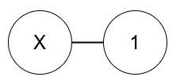

# Class 02: http://codeforces.com/group/aIjl1umqiF/contest/296072

## http://codeforces.com/problemset/problem/1363/C

+ Note: đi ngược lại, nghĩ xem làm như thế nào thì không thua
+ Nghĩ xem để có thể loại đi nút X, cây còn lại PHẢI có dạng như thế nào?
+ Có thể chứng mình được rằng trước khi người thắng thực hiện bước cuối cùng cây có dạng X nối với đúng 1 node khác  . Tức là có 2 node.
+ Tức là người thắng là người mà ở lượt chơi cuối của họ còn 2 node
+ Nếu n chẵn thì người đi trước luôn bắt đầu khi số node là chẵn, và ng đi sau là lẻ. Nên nếu n chẵn, ng đi trc thắng, còn không ng đi sau thắng
+ Nhớ trường hợp X là lá ngay từ đầu

## http://codeforces.com/contest/1391/problem/C
## http://codeforces.com/contest/1405/problem/D

+ Note: đầu tiên, tìm đường đi dài nhất tồn tại trong cây
+ Giả sử Bob có thể nhảy xa nhất là db, Alice là da
  + Giả sử đoạn đường dài nhất có độ dài <= 2*da+1. Thì Alice chỉ cần đi đên trung điểm của đường dài nhất, và thế là trong bước tiếp theo Alice có thể ở bất kì đâu trên cây để đuổi kịp Bob
  + Nếu db<=2*da thì chứng minh rằng Alice luôn có thể đuổi kịp Bob
    + Đầu tiên Alice sẽ đi đến node 1. Khi Alice đến 1, Bob có thể ở bất kì đâu trên cây
    + Ở mỗi bước, Alice nhảy với khoảng cách là 1, đến nút cận với nó hiện tại mà gần Bob nhất.
    + Khi mà đủ gần đên Bob để bắt Bob, Alice sẽ lập tức bắt Bob.
    + Chứng minh cách làm trên đúng: Vì mỗi lần Alice chỉ nhảy với khoảng cách là 1, Bob không thể nhảy qua node của Alice mà duy trì khoảng cách da ( db<=2*da. Và lúc đầu Alice và Bob cách nhau > da)
      + Cứ như vậy, Alice sẽ dồn Bob vào 1 nhánh của cây, rồi nhánh của nhánh cây đấy, etc. Đến cuối cùng Bob sẽ không thể lui sâu hơn vào nhánh đó và Alice chắc chắn bắt đc Bob
  + Nếu db>=2*da+1 thì chứng minh rằng Alice không bao giờ có thể đuổi kịp Bob khi khi độ dài đoạn đường dài nhất thỏa mãn ...

## http://codeforces.com/contest/1336/problem/A

+ Note: đầu tiên, tính xem nếu 1 note phát triển tourism và các node con của nó đều phát triển industry thì độ happiness nó mang lại là bao nhiêu
+ Chứng minh rằng node A là con của node B. Thì nếu node A phát triển tourism thì node B cũng phát triển
+ Cách làm: tính bảng happeness theo như trên, chọn lấy K thằng có độ happeness cao nhất. Từ đó xây dựng được đồ thị và tính happeness trên toàn cây

## http://codeforces.com/contest/1365/problem/D

+ Note: tìm cách block hiệu quả nhất và chứng minh nếu nó không đc, thì không cách nào đc
+ Cách tối ưu là mỗi ô là `.` và chia sẻ cạnh với `B` thì biến thành `#`

```
...B......
..........
G.........
.....B....
......B...
G.........
.....B....
.....B....
..........
..........

..#B#.....
...#......
G....#....
....#B#...
.....#B#..
G....##...
....#B#...
....#B#...
.....#....
..........
```

## Comment

```C++
for (int i=0;i<v.size();i++)
{
    res+=v[i];
    dem++;
    if (dem==k) break;
}
// is similar to
while(dem){
    ...
    --dem;
}
// or
for(int i=0; i<k; i++){
    ...
}
```

```C++
sort(v.begin(),v.end());
reverse(v.begin(),v.end());
// is similar to
sort(v.begin(),v.end(), greater<int>());
// link: https://www.geeksforgeeks.org/sort-c-stl/
```

+ Cố không sử dụng `memset` trừ khi cực kì chắc chắn. Anh không chắc lắm so với for toàn bộ mảng thì có chậm hơn không nhưng `memset` được đánh giá là khá chậm và hơi nguy hiểu nếu không hiểu rõ
+ Chú ý code đẹp