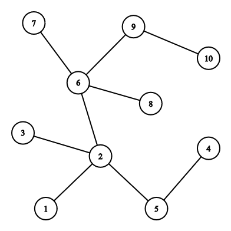

# INIAD VERY FIRST CONTEST

## <b style="color:MediumSpringGreen">STRING - 10 POINTS</b>
```
INPUT: STRING.inp
OUTPUT: STRING.out
```
Given a string S, your job is just print it. This problem is just for testing purpuse. Please note that you have to read and write to file for all problems. The following code is an example of reading, writing from file with C++.
```C++
freopen("STRING.inp", "r", stdin)
freopen("STRING.out", "w", stdout)
```
INPUT:
+ Fist line contain string S ( length < 1000 )

OUTPUT
+ Print string S

### SAMPLE INPUT
```
welcome to our first contest
```

### SAMPLE OUTPUT
```
welcome to our first contest
```

---

## <b style="color:MediumSpringGreen">MINLCM - 1500 POINTS</b>
```
INPUT: MINLCM.inp
OUTPUT: MINLCM.out
```
Given number X (X <= 10<sup>12</sup>). Find two number A and B that:
+ A <= B
+ LCM(A, B) == X ([LCM Wiki Definition](https://en.wikipedia.org/wiki/Least_common_multiple))
+ B is minimum possible

It is guaranteed that:
+ 50% of test X <= 10<sup>6</sup>
+ 100% of Test X <= 10<sup>12</sup>

INPUT
+ The first line of the input contains only integers X ( 1<=X<=10<sup>12</sup> )
+ It is guaranteed that:
    + 50% of test X <= 10<sup>6</sup>
    + 100% of Test X <= 10<sup>12</sup>

OUTPUT
+ Output number A and B

### SAMPLE INPUT 1
```
4
```

### SAMPLE OUTPUT 1
```
1 4
```
### SAMPLE INPUT 2
```
100
```

### SAMPLE OUTPUT 2
```
4 25
```

---

## <b style="color:MediumSpringGreen">LONGEST - 2500 POINTS</b>
Given a tree. Find the longest distance between two vertices of the tree. 

INPUT
+ The first line of the input contains only integers N(2≤N≤10<sup>6</sup>) — the number of vertices in the tree and the number of queries.
+ Each of the next N−1 lines describes an edge of the tree. Edge i is denoted by two integers u_i and v_i, the labels of vertices it connects (1 ≤ u_i, v_i ≤ n, u_i ≠ v_i).
+ It is guaranteed that the given edges form a tree.
+ It is guaranteed that:
    + 50% of test N <= 10<sup>3</sup>
    + 100% of Test N <= 10<sup>12</sup>

Output:
+ Longest distance between two nodes of the tree.

### SAMPLE INPUT
```
10
1 2
2 3
4 5
2 5
2 6
6 7
6 8
6 9
9 10
```

### SAMPLE OUTPUT
```
5
```

### NOTE
Longest distance is between 10 and 4: 10 - 9 - 6 - 2 - 5 - 4



---