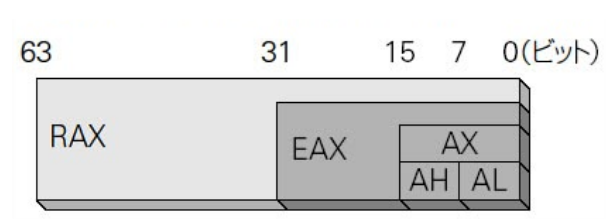
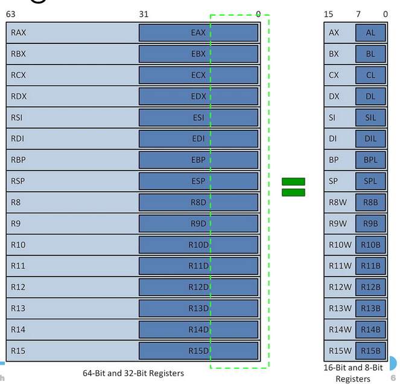
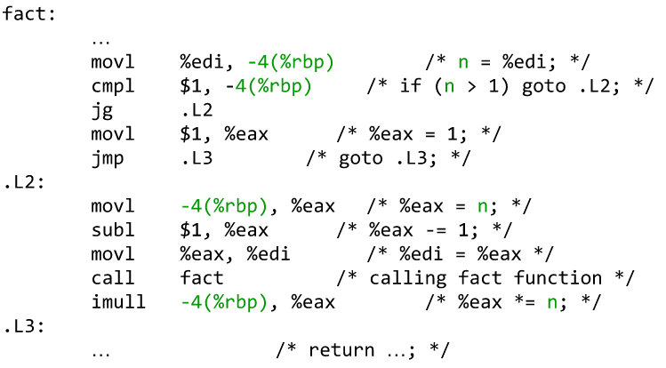
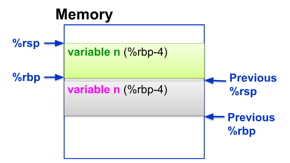
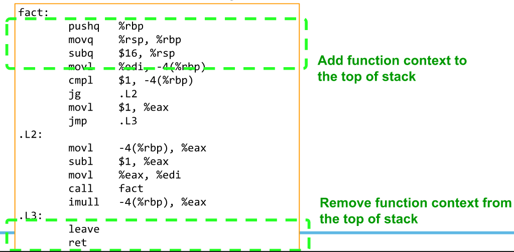
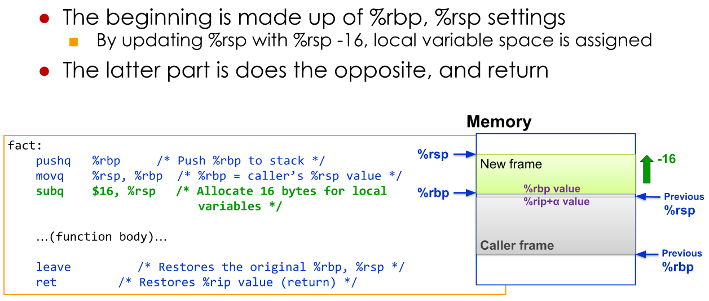

# 1. Ocaml Doc Link

+ http://caml.inria.fr/pub/docs/manual-ocaml/libref/Pervasives.html
+ http://caml.inria.fr/pub/docs/manual-ocaml/libref/List.html
+ https://caml.inria.fr/pub/docs/manual-ocaml/libref/Array.html
+ https://caml.inria.fr/pub/docs/manual-ocaml/libref/Hashtbl.html

# 2. Some note

+ Stuck? want to fucking give up in this? check this [shit](../../../code/ocaml/combination.ml)
+ `a'`, `b'`, ... refer to any type of data
+ Match Master: [match](../../../code/ocaml/atdcheck11.ml)

# 3. OCaml and Functional Programming

1. OCaml
      1. Syntax
           1. AND => `&&`
           2. OR => `||`
           3. NOT => `not`
           4. Connect string => `^`
           5. Different => `<>`
           6. Compare => `=`  (**NOT** `==`)
           7. Using`+ - * /` for int. `+. -. *. /.` for float
           8. Example

               ```ocaml
                 # 1 + 2 ;; (*3*)
                 # 2 * 3 ;; (*6*)
                 # 1 + 2
                 -3 *
                 4;; (*9*)
                 # 1 + 2.3 ;; (* Error: both have to be float*)
                 # float_of_int 1 + 2.3 ;; (*3.3*)
                 # float_of_int 3**2.0 ;; (*float = 9*)
                 # 3.0 < 2.0 ;; (*bool = false*)
                 # "iniad" ^ "toyo" ;; (*iniadtoyo*)
                 # "iniad" <> "toyo" ;; (*bool = true*)
                 # "iniad" = "iniad" ;; (*bool = true*)
                 # "iniad" == "iniad" ;; (*bool = false*)
                 #use "file_name.ml" ;; (*Run script in file*)
                 # (3+5, 5.0, 4.0**5.0) ;; (*- : int * float * float = (8, 5., 1024.)*)
               ```

      2. Tuples: is a combination of several values to be used as a single value
         1. For taking out tuples of 2 values, fst and snd con be used
         2. Example

             ```ocaml
               # (3+5, 5.0, 4.0**5.0);;(*int * float * float = (8, 5., 1024.)*)
               # 3, true, "INIAD", 'a';;(*int * bool * string * char = (3, true, "INIAD", 'a')*)
               # fst(3, 5) ;; (*3*)
               # snd(3, 5) ;; (*5*)
             ```

+ Variables, Functions, Condition
  + Local variables: `let var=value in expression ;;`
  + Function: `let func-name arg1 arg2 ... = body-expression ;;`
    + Recursive Function: `let rec func-name arg1 arg2 ... = body-expression ;;`
    + Calling: `func-name arg1 arg2 ... ;;`
  + Condition: `if condition then expression else expression ;;`
  + Curring: [DERIV.ML](../../../code/ocaml/deriv.ml) **Not yet sure what is currying**
  + Example
    + [GCD.ML](../../../code/ocaml/gcd.ml)
    + [IsPrime.ML](../../../code/ocaml/isPrime.ml)
    + [DERIV.ML](../../../code/ocaml/deriv.ml)
  
# 4. Tail Recursion and Lists

+ Problems: the following codehave time complexity is O(N) which is Okay. But space complexity is also O(N), which is not good
  + Code:
  
    ```ocaml
      let rec factorial n =
        if n <= 0 then 1
        else n * factorial (n-1);;
    ```

    + ![Error][00ocaml1]
  + => Solution: using tail recursion: sending computed result with the function
    + Code

      ```ocaml
        let factorialSpaceO1 n =
          let rec factorial_iter result n =
            if n <= 0 then result
            else
              let newResult = n * result in
              factorial_iter newResult (n-1)
          in factorial_iter 1 n;;
      ```

      + ![Error][00ocaml2]
  + [FACTORIAL.ML](../../../code/ocaml/factorial.ml)
  + [POWER_SPACE_O1.ML](../../../code/ocaml/powerSpaceO1.ml)
+ Pattern Matching
  + Like switch in C but better
  + syntax: `match expression with`
    + Code

      ```ocaml
        let rec fib n =
          match n with
            0 | 1 -> 1 (*0 or 1 then 1*)
            | x -> fib(x-1) + fib(x-2);;(*else ...*)
      ```

  + Patterns could be:
    + Constant pattern
    + Variable pattern
    + OR pattern
    + Constructor patterns (list, tuples)
    + Wild card pattern (the hell is this?)
      + `(_)` will match anything
      + Code

        ```ocaml
          let is_vowel c =
            match c with
              'a' | 'e' | 'i' | 'o' | 'u' -> true
              | _ -> false;;
        ```

    + Alias pattern
      + Code

        ```ocaml
          #match (1, (2, 3)) with (x, (y, z as a)) -> a;; (*int * int = (2, 3)*)
        ```

  + Guard clause: `when`
    + Code

      ```ocaml
        let is_square r =
          match r with
            (w, h) when w=h -> true
            | _ -> false
      ```

  + Note
    + ![Error][00ocaml3]
    + ![Error][00ocaml4]
  + More example: [MATCH_TEST.ML](../../../code/ocaml/matchTest.ml)
+ Lists
  + Basics of Ocaml list:
    + linked list like list
    + have to have the same type
    + Empty list: `[]`
    + Code

      ```ocaml
        # [];;
        - : 'a list = []
        # 1::(2::(3::[]));;
        - : int list = [1; 2; 3]
        # 1::2::3::[];;
        - : int list = [1; 2; 3]
        # 0::[1;2;3];;
        - : int list = [0; 1; 2; 3]
      ```

    + By using `::` in pattern matching, list can be divided into the first element and the res
      + Code

        ```ocaml
          let rec sum nums =
            match nums with
              num::theRest -> num + (sum theRest)
              | [] -> 0;;
        ```

  + `@` operation to connect 2 list
    + Code

      ```ocaml
        # [1;2]@[3;4;5];;
        - : int list = [1; 2; 3; 4; 5]
      ```

  + List built in function: [Link](http://caml.inria.fr/pub/docs/manual-ocaml/libref/List.html)
  + List with patten matching:
    + Code

      ```ocaml
        let randList n =
          match n with
            [x; y; 0] -> 1
            | [x; 0; z] -> x*z
            | [x; y; z] -> x+y+z
            | [x; y; z; t] -> (x+y+z)*t
            | _ -> 0;;
        randList [1;2;3];;
        randList [0;2;3];;
        randList [1;0;3];;
        randList [1;2;0];;
        randList [1;2;0;100];;
        (*
          val randList : int list -> int = <fun>
          - : int = 6
          - : int = 5
          - : int = 3
          - : int = 1
          - : int = 300
        *)
      ```

+ Type Polymorphism and Useful Higher-Order Functions
  + [Need to read again :(](https://moocs.iniad.org/courses/2020/CS112/02/04)
  + Type Polymorphism: By only using func and operation that can perform over all type?
  + [Example](../../../code/ocaml/listFilter.ml)

# 5. Data Structure Representation using User Defined Types

+ Records and Variants
  + define our own type: `type type_name = type_definition`
    + type is kind of struct in C
    + Code

      ```ocaml
        type 'a binaryTree =
          Node of a' * a' binaryTree  * a' binaryTree
          | Leaf;;
      ```

  + Variant Type : Type that have multiple types in it
    + Note: label has to start with capital letter
    + Code:

      ```ocaml
        type 'a binaryTree =
          Node of a' * a' binaryTree  * a' binaryTree
          | Leaf;;
      ```

    + Pattern matching:
      + ![Error][00ocaml5]
  + Type Option
    + ![Error][00ocaml6]
    + [ATD_CHECK.ml](../../../code/ocaml/atdcheck.ml)
      + Note: It allow to `None`, `Some(true)` and `Some(false)`. Normally, there is no way a function can return `true`, `false` and `None`
+ Data Structure
  + [BINARY_TREE.ml](../../../code/ocaml/binarySearchTree.ml)

# 6. Side Effects, and Building up Programs

+ Inputs/Outputs and Building up Programs
  + New way to compile and run:
    + Compile and run: `ocaml filename -o a.out || ./a.out`
    + Run directly: `ocaml filename`
    + Only display print function:
      + ![Error][00ocaml7]
  + Unit type: ()
    + Equivalent to C void
      + ![Error][00ocaml8]
  + Compound Expressions
    + We can list up expressions separately by semicolons:
      + `exp1; exp2; exp3`

        ```ocaml
        let greet() =
          print_string "Name: ";
          let name = read_line() in
            print_endline("Good morning, " ^name);
          print_endline("Hello, " ^name);
          print_endline("Good night, " ^name);
          name;;

        print_string("Great day, " ^ greet());;
        (*
            Name: INIAD
            Good morning, INIAD
            Hello, INIAD
            Good night, INIAD
            Great day, INIAD
        *)
        ```

    + Example print first 3 lines: [HEAD.ml](../../../code/ocaml/head.ml)
  + Note: Printf and Scanf

    ```ocaml
      # Printf.printf "%d %08x %b %s\n" 12 345 false "Hello";;
      12 00000159 false Hello
      - : unit = ()
      # Scanf.sscanf "123 456 789" "%d %s %f" (fun x y z -> (x,y,z));;
      - : int * string * float = (123, "456", 789.)
    ```

+ Representation of States using Mutable Types
  + Variables in Ocaml are actually constant.
    + Example

      ```ocaml
          # let rate = 100;;
          val rate : int = 100
          # let dollar_to_yen d = d * rate;;
          val dollar_to_yen : int -> int = <fun>
          # dollar_to_yen 100;;
          - : int = 10000
          # let rate = 105;;
          val rate : int = 105
          # dollar_to_yen 100;; (*rate in here is still 100*)
          - : int = 10000
      ```

  + Ocaml actually support some kind of variable:
    + Reference
      + Equivalent to var in C
        + [COUNT.ml](../../../code/ocaml/count.ml)
        + Example

          ```ocaml
            # let a = ref 0;;
            val a : int ref = {contents = 0}
            # !a;;
            - : int = 0
            # a;;
            - : int ref = {contents = 0}
            # a := 3;;  
            - : unit = ()
            # !a;;
            - : int = 3
            # a;;
            - : int ref = {contents = 3}
            # a := !a+1;;
            - : unit = ()
            # !a;;
            - : int = 4
          ```

      + Note: Ocaml also equipped with `for/while`
        + [FOR_AND_WHILE.ml](../../../code/ocaml/forAndWhile.ml)
    + Mutable fields
      + By adding `mutable` specification in record field, it will become a mutable field
        + Example

          ```ocaml
            # type student = {name: string; mutable id: int};;
            type student = { name : string; mutable id : int; }
            # let a_san = {name = "AA"; id=100};;  
            val a_san : student = {name = "AA"; id = 100}
            # a_san.id <- 200;;
            - : unit = ()
            # a_san;;
            - : student = {name = "AA"; id = 200}
            # a_san.name <- "BB";;
            Error: The record field name is not mutable
          ```

      + Note: reference is actually a mutable record:

        ```ocaml
          type 'a ref = {mutable contents: 'a};;
          let ref x = {contents = x};;
          (*define ! and := is possible*)
        ```

    + **ASSIGNMENTS AND POLYMORPHISM**
      + ![Error][00ocaml9]
        + Reason is that we have assigned homomorphic value ito a polymorphic reference.
      + ![Error][00ocaml10]
        + Add `r1;;`, type will be decided by ocaml
      + More: [Slide_13_to_15](https://moocs.iniad.org/courses/2020/CS112/04/02#)
    + Objects - Next class

+ Using Imperative Data Structures (Array + Hash Table)
  + Array
    + Create Array: `[|expr1;expr2;expr3;...|]`
      + Use function: [Array_Function](https://caml.inria.fr/pub/docs/manual-ocaml/libref/Array.html)
        + Array.init
        + Array.make
        + Array.make_matrix
        + Example

          ```ocaml
            # let a = [|1;2;3|];;
            val a : int array = [|1; 2; 3|]
            # Array.make 5 15;;
            - : int array = [|15; 15; 15; 15; 15|]
            # Array.init 5(fun i -> i*5);;
            - : int array = [|0; 5; 10; 15; 20|]
            # Array.make_matrix 2 3 5;;
            - : int array array = [|[|5; 5; 5|]; [|5; 5; 5|]|]
          ```

    + Operation on Array
      + Example:

        ```ocaml
          # let a = [|1;2;3|];;
          val a : int array = [|1; 2; 3|]
          # a.(0);; 
          - : int = 1
          # a.(1) <- 4;;
          - : unit = ()
          # a;;
          - : int array = [|1; 4; 3|]
        ```

  + Hash Table
    + [Hash_Table_Function](https://caml.inria.fr/pub/docs/manual-ocaml/libref/Hashtbl.html)
    + Example: [BANK.ML](../../../code/ocaml/bank.ml)
    + ![Error][00ocaml11]

+ Exception Handling and Comparison Operators
  + Handling Exceptions
    + ![Error][00ocaml12]
    + ![Error][00ocaml13]
    + ![Error][00ocaml14]
    + [CAL.ML](../../../code/ocaml/cal.ml)
  + Comparison operator
    + Example using reference:

      ```ocaml
        # let a = ref 1;;
        val a : int ref = {contents = 1}
        # let b = ref 2;;
        val b : int ref = {contents = 2}
        # let c = a;;
        val c : int ref = {contents = 1}
        # a := !a + 1;;  
        - : unit = ()
        # b = c;;
        - : bool = true
        # b == c;;
        - : bool = false
      ```
  
  + Note: be aware when using mutable variable. Compare if pointers are the same, or their contents only.
  + ![Error][00ocaml15]

# 7. Large-Scale Programming and Modules/Functors

## 7.1. Modules

+ Module in OCaml: `Module = Structure + Signature`
  + `Structure`: Provides namespace
  + `Signature`: Provides interface for others to call
    + Can omit `signature` using `sig ... end`
  + ![Error][00ocaml17] 
  + Code Example: [BANK2.ML](../../../code/ocaml/bank2.ml)
+ Note: Separate definition of structure and signature is possible -> More useful for apply common signature to multiple modules
  + Example

    ```Ocaml
      module Bank:
        sig
          (*Signature*)
        end =
        struct
          (*Struct*)
        end

      (* ALSO FOLLOWING IS POSSIBLE *)
      module type BACK_TYPE = 
        sig
          (*Signature*)
        end

      module Bank : BANK_TYPE =
        struct
          (*Struct*)
        end
    ```
+ Opening a module
  + `open ModuleName`
    + Corresponds to `from ModuleName import *`  in Python
    + It is not possible to restrict the names to take in
    + ![Error][00ocaml16] 

## 7.2. Separate Compilation and OMake

+ tag: ml, mli, cmo
+ ![Error][00ocaml22] 
+ ![Error][00ocaml23] 

## 7.3. functor

+ What is `functor`: A function that receives module as argument, create and return copy of that module
  + Hard to understand example, but clever: [MULTISET.ML](../../../code/ocaml/multiSet.ml)
  + Easy to understand example: [TEST_FUNCTOR.ML](../../../code/ocaml/testFunctor.ml)

    ```Ocaml
      type comparison = Less | Equal | Greater

      (* Create Module Signature *)
      module type ORDERED_TYPE = 
        sig
          val cmp : 'a -> 'a -> comparison
        end;;

      (* Create Module *)
      module AscendingInt : ORDERED_TYPE =
        struct
          let cmp x y = 
            if x = y then Equal
            else if x < y then Less
            else Greater 
        end;;

      module DescendingInt : ORDERED_TYPE =
        struct
          let cmp x y = 
            if x = y then Equal
            else if x > y then Less
            else Greater 
        end;;

      (* Create New Module Extent Of ORDERED_TYPE *)
      module type ORDERED_TYPE_EXTENTED = 
        functor (Elt: ORDERED_TYPE) ->
        sig
          val compare: 'a -> 'a -> comparison
        end

      module OrderedIntExtented : ORDERED_TYPE_EXTENTED =
        functor (Elt: ORDERED_TYPE) ->
        struct
          let compare fst snd = Elt.cmp fst snd;;
        end

      module Ascending = OrderedIntExtented(AscendingInt);;
      module Descending = OrderedIntExtented(DescendingInt);;
      Ascending.compare 1 3;; (* - : comparison = Less *)
      Descending.compare 1 3;; (*- : comparison = Greater*)

      (* #use "testFunctor.ml";; *)
    ```

## 7.4. Object-Oriented Programming with Ocaml

### 7.4.1. Object Definition and Access

+ New object can be created with `object ... end`
  + For declare variable, use `val`
  + For declare function, use `method`
+ For Accessing `object#method`
+ ![Error][00ocaml18] 

### 7.4.2. Class Definition for reusing Object

+ Reuseable object code, use class
+ ![Error][00ocaml19] 

### 7.4.3. Polymorphic Class and Class Parameter
+ ![Error][00ocaml20] 

### 7.4.4. Class inheritance
+ ![Error][00ocaml21] 

# 8. Parsing and Representation of Variables

+ Check [MACRO_PYTHON](../../../code/ocaml/micropython/main.ml)

  ```ocaml
    let main argc argv =
    let env = ValueEnv.create () in
    if argc = 2 then
      Load.load_file argv.(1)
      |> Load.convert_block
      |> Lexing.from_string
      |> Parser.prog Lexer.token
      |> Eval.eval_stmt_list env
    else prerr_endline "Usage: micropython <filename>"

    let _ = main (Array.length Sys.argv) Sys.argv
  ```
+ Running Sequence 
  +  [SYNTAX](../../../code/ocaml/micropython/syntax.ml)
  +  [LEXER](../../../code/ocaml/micropython/lexer.mll)
  +  [PARSER](../../../code/ocaml/micropython/parser.mly)
  +  [EVAL](../../../code/ocaml/micropython/eval.ml)

# 9. Function Closure and Environment Model

+ Check [MINI_PYTHON](../../../code/ocaml/minipython/main.ml)
+ To implement scope, using stack env. In detail:

  ```ocaml
    (* variable environment *)
    type ('a, 'b) t = ('a, 'b) Hashtbl.t list

    let create () = [Hashtbl.create 256]

    let assign env ident v =
      match env with
        top::_ -> Hashtbl.replace top ident v
      | [] -> failwith "empty environment"

    let rec get env ident =
      match env with
        top::rest ->
        begin
          try Hashtbl.find top ident
          with Not_found -> get rest ident
        end
      | [] -> raise Not_found

    let extend env =
      (Hashtbl.create 256)::env
  ```

+ After we solve the problems with scope, the res is just define syntax

  ```ocaml
    and pyexpr =
      ConstExpr of pyvalue
    | IdentExpr of pyident
    | BinopExpr of pybinop * pyexpr * pyexpr
    | FunctionCallExpr of pyident * pyexpr list

    and pystmt =
        AssignStmt of pyident * pyexpr
      | IfStmt of pyexpr * pystmt list * pystmt list
      | WhileStmt of pyexpr * pystmt list
      | ExprStmt of pyexpr
      | DefStmt of pyident * pyident list * pystmt list
      | ReturnStmt of pyexpr
  ```

# 10. Lexical Analysis and Finite Automata

## 10.1. How Compilers Work

+ Each step is relatively simple, but as a whole, they could make a compiler
  + ![Error][00ocaml24]
+ Lexing and Parsing
  + ![Error][00ocaml25]

## 10.2. Deterministic Finite Automata (DFA)

+ DFA: A virtual state machine that starts from some initial state, and continues state transition on every input given 
  + https://en.wikipedia.org/wiki/Nondeterministic_finite_automaton#Formal_definition
  + ![Error][00ocaml27]
  + Formally, DFA M is defined as a 5-tuple:
    + ![Error][00ocaml26]

## 10.3. Regular Expressions and Finite Automata

+ Hard to convert regular expressions(eg: `11(01)*110`) to DFA directly. Can use the following as a middleware
  + `non-determinism` (NFA)
    + ![Error][00ocaml28]
  + `ε-transition`
    + ![Error][00ocaml29]


### 10.3.1. Convert Regex -> ε-NFA
  
  + ![Error][00ocaml30]

### 10.3.2. Convert ε-NFA -> DFA

+ To convert, we need 2 steps:
  + Removal of `ε-transition`
    + ![Error][00ocaml31]
  + Convert NFA -> DFA (called `determinization`)
    + ![Error][00ocaml32]

## 10.4. Lexical Analysis with ocamllex

+ https://moocs.iniad.org/courses/2020/CS112/09/04

# 11. Mechanisms of Parsing

##  11.1. Overview of LR Parsing

### 11.1.1. How can we perform parsing

+ `Parsing` can be performed by deriving syntax tree in reverse the list of tokens(leafs) towards start symbol (root)
  + ![Error][00ocaml33]

### 11.1.2. Algorithm for parsing

+ LL(k) parsing (k=0, 1, 2, ...)
+ LR(k) parsing (k=0, 1, 2, ...)
  + Reads token from the **LEFT**, and derivers in reverse from the **RIGHTMOST** position on read so far
    + ![Error][00ocaml34]
  + LR parsing is made up of 2 operations: `shift/reduce`
    + `SHIFT`: Fetch a new token from program
    + `Reduce`: Derives the rightmost part of list of symbols already read accordingly to the rules defined by `BNF/EBNF`
      + ```ocaml
          E ::= E + E
              | E * E
              | ( E )
              | INT
              | VAR

        ```

    + ![Error][00ocaml35]
    + ![Error][00ocaml36]

### 11.1.3. Implement LR parsing using automaton (concept)

+ Parsing can be implemented using automata
  + ![Error][00ocaml37]
  + [parser.mly](../../../code/ocaml/cflat/parser.mly)
    + `menhir --dump parser.mly`
      + [PARSER.AUTOMATON](../../../code/ocaml/cflat/parser.automaton)

## 11.2. Syntactic Ambiguity and Conflicts

+ ![Error][00ocaml38]
+ In general, there are two types of conflict
  + Reduce/Reduce conflict
    + ![Error][00ocaml39]
  + Shift/Reduce conflict
    + ![Error][00ocaml40]
  + How to solve:
    + Follow defined rule
    + `Shift` is prefer if multiple choice
    + Detail: [Slide 6->9](https://moocs.iniad.org/courses/2020/CS112/10/02)

# 12. Semantic Analysis and Intermediate Representation

## 12.1. Semantic Analysis and Type Checking

### 12.1.1. What is `Semantic Analysis`

+ Although programs may look the same, their behavior are different according to variables' types
  + `c = a+b` with `a`, `b` are `int`
  + `c = a+b` with `a`, `b` are `string`
+ Semantic Analysis: Process required for compilers to understand the meaning of programs 
  + ![Error][00ocaml41]

### 12.1.2. Execution of `Type Checking`

+ We can do it recursively. [TypeCheck](../../../code/ocaml/typechk1.ml)

  ```ocaml
    let rec type_expr = function
        Add(e1, e2) ->
        begin
          match type_expr e1, type_expr e2 with
            IntType, IntType -> IntType
          | StrType, StrType -> StrType
          | FloatType, FloatType -> FloatType
          | FloatType, IntType | IntType, FloatType -> FloatType
          | _ -> failwith "type error"
        end
      | Mul(e1, e2) ->
        begin
          match type_expr e1, type_expr e2 with
            IntType, IntType -> IntType
          | IntType, StrType | StrType, IntType -> StrType
          | FloatType, FloatType -> FloatType
          | FloatType, IntType | IntType, FloatType -> FloatType
          | _ -> failwith "type error"
        end
      | Value(IntVal(_)) -> IntType
      | Value(StrVal(_)) -> StrType
      | Value(FloatVal(_)) -> FloatType
  ```

### 12.1.3. Type-checking expressions include variables.

+ We can manage variable type using the same method to manage variable data.

## 12.2. Semantic Analysis in C_flat: [here](https://moocs.iniad.org/courses/2020/CS112/11/02)

## 12.3. Intermediate Representation and K-Normal Form

# Static Single Assignment (SSA) Form

+ Basically, we have to convert `K-normal form` into `SSA form` before register variable in to `register`
  + ![Error][00ocaml42]![Error][00ocaml43]

## Register Allocation

+ Assuming that we have infinite number of register, we can just easily convert `K-normal form` to `machine code` directly.
  + ![Error][00ocaml44]
+ But, normally, we can have just 16 of `register`, and only 13 of them can use freely. That why we need convert `K-normal form` to `SSA form` as a step stone to `machine code`
  + ![Error][00ocaml45] 
+ Register allocation corresponds to `coloring problem`
  + For example we have only 4 register
    + ![Error][00ocaml46] 

## Static Single Assignment (SSA) Form

+ Static Single Assignment (SSA) Form: Form of program where each variable can **have at most one assignment**. This, preventing updating of variable contents
  + ![Error][00ocaml47]
+ SSA optimizations are way easier
  + ![Error][00ocaml48]

### Some programs are not convert_able to SSA ( and way to fix)

![Error][00ocaml49]
+ We define a virtual function Φ (phi function) that selects either one of arguments, according which path did it take to reach the join point in `control flow graph` [LINK](https://en.wikipedia.org/wiki/Static_single_assignment_form)
  + ![Error][00ocaml50]
+ The procedures of SSA conversion:
  + ![Error][00ocaml51]

# Calling Convention and Register Allocation

## Review from operating system
  
+ 16 general purpose registers
  + r0 -> r7, alias names are given according to their special usages
    + ro = rax: accumulator
    + r1 = rcx: counter
    + r2 = rdx: data
    + r3 = rbx: base
    + r4 = rsp: stack pointer
    + r5 = rbp: base pointer
    + r6 = rsi: source index
    + r7 = rdi: destination index
  + We can add suffixes to access partial bits
    + d: double word: lower 32 bits
    + w: word: lower 16 bits
    + b: byte: lower 8 bits
    + Example
      + r0d = eax: Lower 32 bits of register r0
      + 
      + 

---------

+ Function Call and Calling Convention
  + Function Call Example

    + ```c
        int fact(int n){
          if( n <= 1 ){
            return 1;
          }
          return n * fact(n-1);
        }
      ```

    + 
      + n = %edi
      + If n <= 1
        + %eax = 1
      + Else
        + %edi = n - 1 ( %eax = n; %edi = %edx - 1 )
        + Call fact so that %eax = fact(n-1)
        + %eax *= n
      + Return %eax
  + Calling Convention: A rule of how arguments and return values are passed
    + Rules for passing integer/pointer arguments
      + First Argument: %rdi
      + Second Argument: %rsi
      + Third: %rdx
      + Fourth: %rcx
      + Fifth: %r8
      + Sixth: %r9
    + Rule for returning integer/pointer value: Use %rax
  + ***Stack Frame***
    + Have %rbp(base pointer) and %rsp(stack pointer)
      + 
    + Stack Frame Operations
      + 
      + 
      + Explain:
        + First `pushq %rbp` to save **caller frame** base point
        + Then `movq %rsp, %rbp` to move %rbp to **new frame** base point
        + Then `subq $16, %rsp` to allocate 16 bytes for local variables
          + => All local variables will be store within %rbp and %rps, including caller frame's base pointer

## Basics of Register Allocation

+ Register allocation correspond to `coloring problem`
  + ![Error][00ocaml46]
  + ![Error][00ocaml45]
  + We can describe it as a graph problems: Painting adjacent vertices with different colors, using at most k-colors
    + ![Error][00ocaml52]
+ Although this is a NP problems, we can use easily solve it in a not optimal way by using greedy
  + ![Error][00ocaml53]
+ In case we do not have enough register, we can use `register spilling`
  + `register spilling` has 2 actions
    + Save `variable content` in `register` to memory (stack) as backup
    + Restore `variable content` to `register`
    + ![Error][00ocaml54]
    + ![Error][00ocaml55]
  + Example of `register spilling`
    + ![Error][00ocaml56]
    + ![Error][00ocaml57]

## Constraints Related to Register Allocation ( 2-operand instructions)

+ Register coalescing for 2-operand instructions: Try to coalesce registers of the first source operand and destination operand to be the same
  + `x = a - b`: Try to allocate the same registers for x and a
  + `y = z * w`: Try to allocate the same registers for y and w
  + `p = q`: Try to allocate the same registers for p and q
  + `x=a-b; print(x); print(a;`: Cannot coalesce variables whose liveness periods overlap
+ Calling conventions and coalescing arguments/return value
  + ![Error][00ocaml58]
+ Conventions regarding about register usage
  + `Caller-save registers` (all registers used for arguments/return values + %r10~11)
    + Allowed to be modified inside functions 
    + When function caller uses these registers, it is needed to save the register contents into memory before function call, and later restore them after the function call
  + `Callee-save register (%rbx, %rbp, %rsp, %r12-15)`
    + ***Not*** allow to be modified inside function
    + If want to modify them inside functions, the register contents need to be saved into memory and later restore back to register, before returning from function
+ Calling convention and register backup
  + When a function is called, register value are needed to be backed up. There are 2 methods for that
    + `Caller-save`: Backup register before function call, and restore it when needed
    + `Callee-save`: Register is backed-up/restore inside the function call.
  + When to use each:
    + If a variable stays alive after function call, use `callee-save`
    + Otherwise, try to use `caller-save` as much as possible
    + ![Error][00ocaml59]

# Machine Code Generation and Advanced Topics

## Machine Code Generation

+ Step 7L Code generation & Assemble ![Error][00ocaml24]
  + Convert function
    + ![Error][00ocaml60]
    + ![Error][00ocaml61]
  + Convert instruction
    + Divided into case, whether by register are coalesced or not![Error][00ocaml62]
  + Convert `if` statement
    + ![Error][00ocaml63]
  + Convert `while` statement
    + ![Error][00ocaml64]

## Putting Compiler Elements Together [LINK MOOCS](https://moocs.iniad.org/courses/2020/CS112/14/02)

## Optimization in Compilers

+ Ino oder to make compilers smarter, we can insert optimizations in conversion steps
  + ![Error][00ocaml65]
+ More: [Moocs LINK](https://moocs.iniad.org/courses/2020/CS112/14/03)

## Automatic Memory Management with Garbage Collection

+ Heap and Stack [INFO](https://stackoverflow.com/questions/79923/what-and-where-are-the-stack-and-heap)
+ In Python, values need to be allocated in heap memory, not on stack (slower, but able to access anywhere). And that lead to the problems when should we free them.
+ In detail [MOOCS LINK](https://moocs.iniad.org/courses/2020/CS112/14/04)

[00osys01]: ./../../secondYear/image/00osys01.png
[00ocaml1]: ./../image/00ocaml1.png
[00ocaml2]: ./../image/00ocaml2.png
[00ocaml3]: ./../image/00ocaml3.png
[00ocaml4]: ./../image/00ocaml4.png
[00ocaml5]: ./../image/00ocaml5.png
[00ocaml6]: ./../image/00ocaml6.png
[00ocaml7]: ./../image/00ocaml7.png
[00ocaml8]: ./../image/00ocaml8.png
[00ocaml9]: ./../image/00ocaml9.png
[00ocaml10]: ./../image/00ocaml10.png
[00ocaml11]: ./../image/00ocaml11.png
[00ocaml12]: ./../image/00ocaml12.png
[00ocaml13]: ./../image/00ocaml13.png
[00ocaml14]: ./../image/00ocaml14.png
[00ocaml15]: ./../image/00ocaml15.png
[00ocaml16]: ./../image/00ocaml16.png
[00ocaml17]: ./../image/00ocaml17.png
[00ocaml18]: ./../image/00ocaml18.png
[00ocaml19]: ./../image/00ocaml19.png
[00ocaml20]: ./../image/00ocaml20.png
[00ocaml21]: ./../image/00ocaml21.png
[00ocaml22]: ./../image/00ocaml22.png
[00ocaml23]: ./../image/00ocaml23.png
[00ocaml24]: ./../image/00ocaml24.png
[00ocaml25]: ./../image/00ocaml25.png
[00ocaml26]: ./../image/00ocaml26.png
[00ocaml27]: ./../image/00ocaml27.png
[00ocaml28]: ./../image/00ocaml28.png
[00ocaml29]: ./../image/00ocaml29.png
[00ocaml30]: ./../image/00ocaml30.png
[00ocaml31]: ./../image/00ocaml31.png
[00ocaml32]: ./../image/00ocaml32.png
[00ocaml33]: ./../image/00ocaml33.png
[00ocaml34]: ./../image/00ocaml34.png
[00ocaml35]: ./../image/00ocaml35.png
[00ocaml36]: ./../image/00ocaml36.png
[00ocaml37]: ./../image/00ocaml37.png
[00ocaml38]: ./../image/00ocaml38.png
[00ocaml39]: ./../image/00ocaml39.png
[00ocaml40]: ./../image/00ocaml40.png
[00ocaml41]: ./../image/00ocaml41.png
[00ocaml42]: ./../image/00ocaml42.png
[00ocaml43]: ./../image/00ocaml43.png
[00ocaml44]: ./../image/00ocaml44.png
[00ocaml45]: ./../image/00ocaml45.png
[00ocaml46]: ./../image/00ocaml46.png
[00ocaml47]: ./../image/00ocaml47.png
[00ocaml48]: ./../image/00ocaml48.png
[00ocaml49]: ./../image/00ocaml49.png
[00ocaml50]: ./../image/00ocaml50.png
[00ocaml51]: ./../image/00ocaml51.png
[00ocaml52]: ./../image/00ocaml52.png
[00ocaml53]: ./../image/00ocaml53.png
[00ocaml54]: ./../image/00ocaml54.png
[00ocaml55]: ./../image/00ocaml55.png
[00ocaml56]: ./../image/00ocaml56.png
[00ocaml57]: ./../image/00ocaml57.png
[00ocaml58]: ./../image/00ocaml58.png
[00ocaml59]: ./../image/00ocaml59.png
[00ocaml60]: ./../image/00ocaml60.png
[00ocaml61]: ./../image/00ocaml61.png
[00ocaml62]: ./../image/00ocaml62.png
[00ocaml63]: ./../image/00ocaml63.png
[00ocaml64]: ./../image/00ocaml64.png
[00ocaml65]: ./../image/00ocaml65.png
[00ocaml66]: ./../image/00ocaml66.png
[00ocaml67]: ./../image/00ocaml67.png
[00ocaml68]: ./../image/00ocaml68.png
[00ocaml69]: ./../image/00ocaml69.png
[00ocaml70]: ./../image/00ocaml70.png
