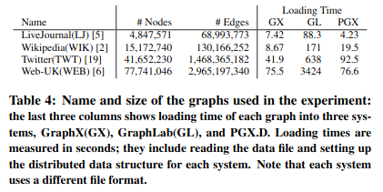

# Investigation result on solution to distributed graph processing using PGX.D: A Fast Distributed Graph Processing Engine

## Graph Analysis Overview and introduction of PGX.D

+ Graph analysis is a powerful method in data analysis. Normally, we can summarize any analysis process into 2 step
  + Step 1: Gather data from it immediate neighbor (vertices that directly share an edge)
  + Step 2: Compute using gatherd data
  + Step 3: Update its new value and send it out to neighbor vertices
+ To able to improve graph processing performance, we need to first understand some of its characteristics:
  + The size of the graph is very large – larger than the capacityof a single machine’s main memory.
  + Many small-sized random memory accesses over the wholegraph instance are performed, especially during neighborhood iterations and graph traversals
  + The computation-to-communication ratio is low
  + There is a large degree of inherent parallelism.
+ And also, problems with most of the graph processing frameworks:
  + `Network overload`
  + `Load Balancing`
+ Although several frameworks have been proposed for processing large graph instances in distributed environments, their performance is much lower than using efficient single-machine implementations provided with enough memory. In this report, we will get more insight about PGX.D, a fast  distributedgraph  processing  system. The result in the paper shows that  PGX.D outperforms other distributed graph systems like GraphLab significantly (3x – 90x). Furthermore, running PGX.D on 4 to 16 machines is also  faster  than  an  implementation optimized for single-machineexecution

## PGX.D Overview Design

+ Overall, PGX.D try to improve process efficiency by combining multiple methods about `Task Management`, `Data Management` and `Communication Management`. Here in this report, we will mainly forcus on techniques to solve `Network overload` and `Load Balancing`. Though in the paper, there are plenty of technical techniques helps to speed up the process, but they are out of scope for this report.
+ Overview structure of a slave note. Each  machine  is  loaded  with  fairly  large  amounts  of  memory  aswell as many CPU cores, and the machines are connected by modern high-bandwidth, low-latency networks
  + 
  + The graph algorithm is decomposed into numerous small task that can run in parallel (Each task in charge of some vertice)
  + Whenever a task reads or writes graph data, it checks withthe `Data Manager` which knows the location of the data. If the data resides in the current machine, the access is immediately resolved; otherwise,  the  Data  Manager  buffers  up  the  request  into  a  large request message
  + The blocked tasks are resumed when the response messagefor the corresponding request message comes back

### To solve `Network Overload`

+ When loading the graph from very beginning, each vertice is labeled with a 64-bit number which concatenates the machine number and the local offset for that particular vertice. In that way, `Data manager` can immediately known location of any vertice.
+ PGX.D has both `pull data mode` and `push data mode`
  + `pull data mode`: When a vertice needed data from its immediate neighbors, it can pull data from them
  + `push data mode`: When a vertice complete its computation, can can send result to immediate neighbors
+ Using buffer to reduce network traffic. Request only be sent when message buffer has reached its maximum size or the worker thread has completed all task
+ Using `Selective Ghost Node`
  + `Selective ghost node creation` is a technique to choose a set of high-degree vertices and to duplicate ghost copies of them on each machine. `Ghost Nodes` are selected at loading time (using in-degree and out-degree)

### To `Load Balancing`

+ PGX.D use `Edge Partitioning` to load balance. That is, each slave node is given equally number of edges
  + .
+ In detail, before partitioning the graph, PGX.D first computes the total sum of in-degrees and out-degrees for all vertices.It then chooses the pivot vertices that result in a balanced sum of in-degrees and out-degrees for each partition.

## Evaluation

+ To evaluate, PGX.D is applied to run numbers of algorithm on 4 big graph data:
  + 
+ Result:
  + 
  + 
+ Overall, we can conclude that PGX.D is significantly faster than other framework.

## Reference

+ Sungpack Hong; Siegfried Depner; Thomas Manhardt; Jan Van Der Lugt; Merijn Verstraaten; Hassan Chafi: PGX.D: A Fast Distributed Graph Processing Engine 

