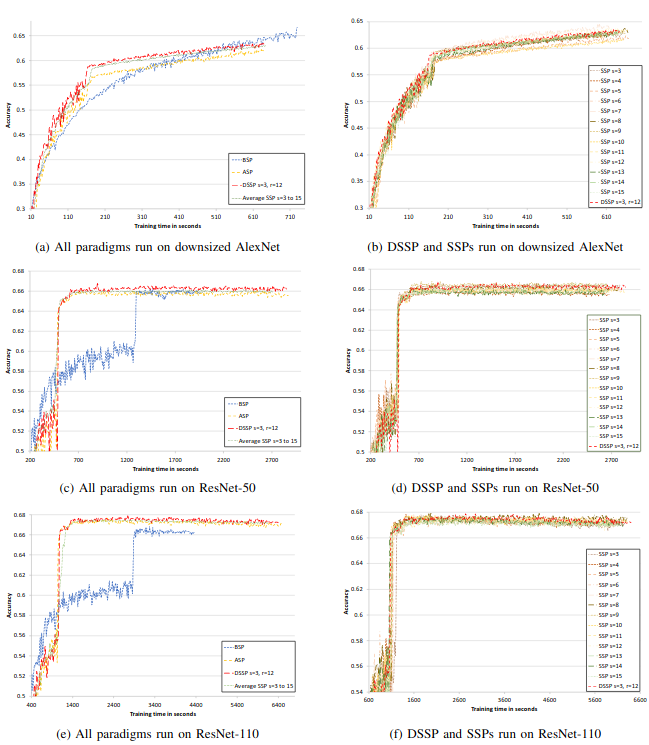

#  Investigation result on solution to distributed machine leaning using Dynamic Stale Synchronous Parallel(DSSP)

## 1. Sum up distributed paradigms BSP, ASP and SSP

### 1.1. Bulk  Synchronous  Parallel (BSP)

+ In BSP, all node workers send their computed gradients to parameter server for global weight update, and wait for each other for synchronization. Once the parameter server receives gradients from all workers and updates the global weights, it sends the latest global weights to  the  workers  before  each  worker  starts  a new  iteration.
+ Advantages: Normally have highest accuracy as all node worker always share same latest weight.
+ Disadvantages: Slowest due too all the workers node have to wait for the slowest one to complete computing

### 1.2. Asynchronous  Parallel  (ASP)

+ In  ASP,  all  worker node ssend  their  computed  gradients  to  the  parameter  server  after each  iteration  but  no  synchronization  is  required. Worker nodes do not wait for each other and simply run independently.
+ Advantages: Fastest due to each worker run independently
+ Disadvantages: As all workers run independently, the weight each worker carry might be different and lead to less accuracy result

### 1.3. Stale  Synchronous  Parallel  (SSP)

+ SSP  is  a  combi-nation  of  BSP  and  ASP.  It  relies  on  a policy  to  switchbetween ASP and BSP dynamically during the training. As the number  of  iterations between fastest worker and slowest worker not yet exceed a pre-determinded number `S`, the fastest worker can continue running next iteration. As a result, it is faster than BSP and more accurate than ASP

## 2. Dynamic Stale Synchronous Parallel (DSSP)

+ In SSP, the pre-determinded number `S` is fixed  which leads to two problems:
  + It is hard to determine optimal value of `S`. Normally, this is only possible to essimate though manually searching via many trials
  + A single fixed value `S` may not be suitable for the whole training process
+ DSSP can solve these problems by installing a `synchronization controller` at the parameter server to  determine  how  many  iterations  the  current  fastest worker node should  continue  running  at  the  end  of  its  iteration. This `synchronization controller` will make the decision at run time by estimating the future waiting times of workers based on the timestamps of their previous `push requests` and selecting a  point  in  the  range (`S_L`, `S_U`)  that  leads  to  the  least  estimated waiting time.

### 2.1. Simplified Implementation of DSSP

+ Pseudo code of worker `p` at iteration `t_p`

    ```
        1. wait until receiving OK signal from server
        2. pull updated weights from server and replace it with current local weight
        3. run iteration t_p
        4. push result to server
    ```

+ Pseudo code of server when receiver push result from worker `p`. 
  + `r_p` stores  the  number  of  extra  iterations  worker p is allowed   beyond S_L,   initialized   to   zero   at   the   verybeginning;
  + (`S_L`, `S_U`) waiting range. Pre-determined.
  + `t_i` stores  the  number  of push requests  received  from worker i so far

    ```
        1. t_p = t_p + 1
        2. updata server weight accordingly to new push result
        3. if (r_p > 0) then
           1. r_p = r_p - 1
           2. Send OK to worker p
        4. else
           1. find the slowest and fastest workers based on array t
           2. if t_p - t_slowest <= S_L then send OK to worker p
           3. else if worker p is the fastest worker
              1. r_p <- synchronization_controller
              2. if r_p > 0 then send OK to worker p
           4. else wait for slowest worker to finish
    ```

### 2.2. Experiment Result




Ref: Xing Zhao, Aijun An, Junfeng Liu, Bao Xin Chen. Dynamic Stale Synchronous Parallel Distributed Training for Deep Learning