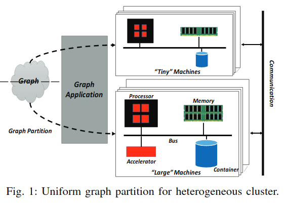

# Report on solution to speed up Graph Processing by improving load balancing.

- [Report on solution to speed up Graph Processing by improving load balancing.](#report-on-solution-to-speed-up-graph-processing-by-improving-load-balancing)
  - [Problem Introduction](#problem-introduction)
  - [Solution for load balancing](#solution-for-load-balancing)
    - [General idea](#general-idea)
    - [Note Indexing](#note-indexing)
    - [Sort Running Time](#sort-running-time)
    - [Exchanging vertices](#exchanging-vertices)
    - [Access Exchanged Vertices](#access-exchanged-vertices)
    - [Support Scaling Up](#support-scaling-up)
  - [References](#references)

## Problem Introduction

+ To guaranteethe quality of different services while lowering maintenanceand energy cost, data centers deploy a diverse collectionof compute nodes ranging from powerful enterprise serversto networks of off-the-shelf commodity parts. Besidesrequirements on service quality, cost and energy consumption,data centers are continuously upgrading their hardware in arotating manner for high service availability. These trendslead to the modern data centers being populated with hetero-geneous computing resources. For instance, low-cost ARM-based servers are increasingly added to existing x86-basedserver farms to leverage the low energy consumption. Despite these trends, most cloud computing and graph processing frameworks, like Hadoop , and PowerGraph, are designed under the assumption that all computingunits in the cluster are homogeneous [1]
  + 
+ And to make the problems even harder, it is not easy to calculate the best ratio of work for each machine. As in graph processing, computation-to-communication ratio is very low [2]
  + 
+ And also, with the rapid development of web service that provides computing capacity, nowadays, most service providers support auto scaling that allow multiply number of running instance when needed such as Amazon EC2 or Microsoft Azure. But still, most graph processing frameworks only run partitioning when loading the graph in stead of support scaling up when needed.
+ To resolve that, in this report, I propose a method that allow process improve load balancing while running, and also add the ability to scale up number of running computers/server instances when needed.

## Solution for load balancing

### General idea

As in graph processing, computation-to-communication ratio is very low [2], we want to ultilize unuse computation capacity to sort all machines by running time each round. After that, slower machine will send a number of vertices to faster machine for next round computition.

### Note Indexing

+ Here we assume that the vertices are numbered from 0 to N−1 by a preprocessing step. During loading, we decide how these vertices are partitioned into P machines.  All the vertices will be re-index with a 64 bits number. First 16bits show where the vertex is located, and the last 48bits shows its assigned number. This information will be shared accross all machines so that when the information of a vertice is needed, the machine can easily know where to look for it.[3]
  + If the number of node (N) or the number of machines (P) are too big, it is possible to index each vertex with a 128 bits number.

### Sort Running Time

+ After  finished 70% computation of each round, the machine will broadcast a message to signal this event as at this time, we can predict with high accuracy how much time the machine will need to finish the round.
+ In each machine, after receive all the time to finish 70% work load from all the machines, it will sort all the machine by running time from fastest to slowest. As the information all the machines receive should be identical, the sorted list in each machine should also be identical.

### Exchanging vertices

+ After obtained the sorted running time list, the slowest machine will contact will fastest machine for exchaning node, the second slowest with the second fastest, and so on.
+ When i-th slowest machine(machine S) contact with i-th fastest machine(machine F), S will send 2 number:
  + number of vertices that S has: `Ns`
  + time in average for S to finish computation for one vertex: `Ts`
+ F after receive `Ns` and `Ts`, with `Nf` is number of vertices F has and `Tf` is time in average for F to finish computation for one vertex. F will send request that accept `N-exchange` vertices from F with:

    `N-exchange = (Ns x Ts - Nf x Tf) / ( Ts + Tf ) * a` (0.25 < a < 0.75. Default 0.5)
+ Finally, S send a list contain `N-exchange` re-indexed vertices to F with first 16bit show value of F instead of S. Next round, F will compute these vertices for S

### Access Exchanged Vertices

+ After S sends `N-exchange` vertices to F, these vertices index are not updated other than in S and F. As the result, when needed data from these vertices, other machines still send request to S in stead of F.
+ To solve this, after each round, S still store value of these vertices by copying from F. Also, in reply message, S will also includes new index of these vertices so that next time F will be asked.
+ After pre-determined number of round with no machine request for value of these vertices, S will stop copying value from F instead only keep newer index that point to machine

### Support Scaling Up

+ When new machine join the process, it will immediately broadcast that it finished 70% the work load in 0ms. By this in next round, it will receive vertices from slowest machines.

## References

[1] Shuang Song, Meng Li,et al., "Proxy-Guided Load Balancing of Graph ProcessingWorkloads on Heterogeneous Clusters" p77. 2016

[2] Sungpack Hong, Siegfried Depner,et al., "PGX.D: A Fast Distributed Graph Processing Engine" p1. 2018

[3] Sungpack Hong, Siegfried Depner,et al., "PGX.D: A Fast Distributed Graph Processing Engine" p3. Data Management
