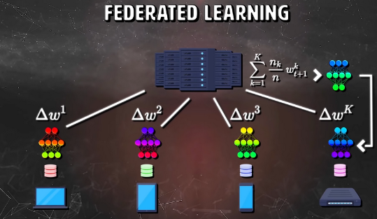
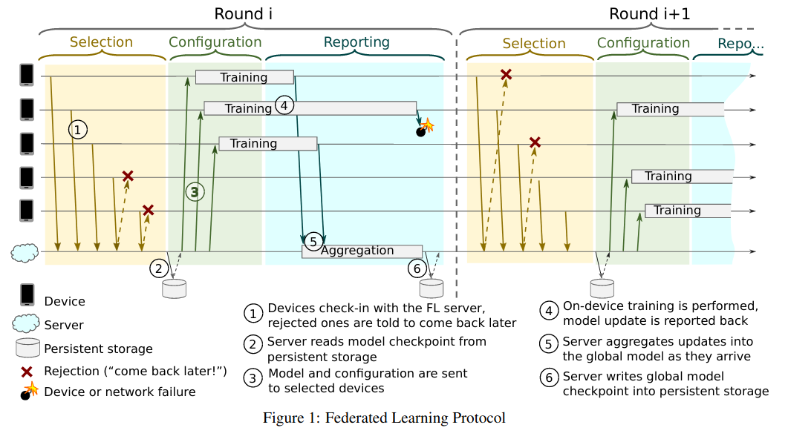
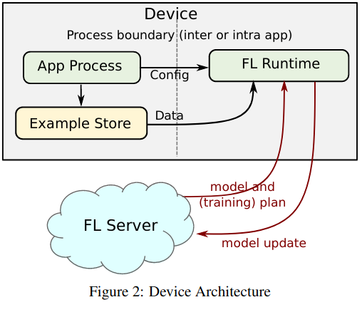
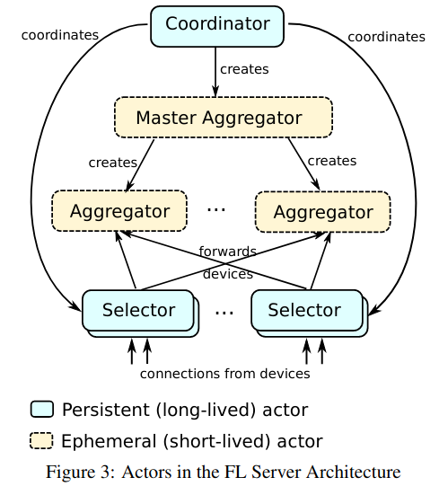
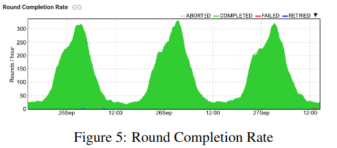

#  Investigation result on Distributed processing and privacy protection in the cloud using Federated Learning

## 1. Overview about Federated Learning System Design

+ Federated Learning is a distributed machine learning approach which enables model training on a large corpus of decentralized data
+ The idea is “bringing the code to the data, instead of the data to the code”
  + 
+ Using SSP over ASP due to many reasons:
  + There has been a consistent trend towards synchronous large batch training, even in the data center
  + Enhancing privacyguarantee
    + Differentail Privacy
    + Secure Aggregation: server side of the learningalgorithm only consumes a simple aggregate of the updatesfrom many users
+ This system is yet still far from perfect as existing numerous practical issues
  + Device availability  that  correlates  with  the  local  data  distribution  incomplex ways
  + Unreliable device connectivity and interrupted execution
  + etc

## 2. System Architecture

## 2.1 Basic Notions

+ The basic participants in protocal are `devices`(android phone) and the `FL server`
+ `Devices` will first annouce to server that they are ready to run an `FL task` for a givin `FL population`
  + An `FL population` is specified by a globally unique namewhich identifies the learning problem, or application
  + An `FL task` is a specific computation for anFL population, such as training to be performed with givenhyperparameters, or evaluation of trained models on localdevice data.
+ From the potential tens of thousands of devices announcingavailability to the server during a certain time window, theserver selects a subset of typically a few hundred which are invited to work on a specific `FL task` 
+ The `server` then tells the selected `devices` what computation to runwith an `FL plan`: a data structure that includes a TensorFlowgraph and instructions for how to execute it
+ Once a round is established, the server next sends to each participant the current global model parameters and any other necessarystate as an `FL checkpoint`(essentially the serialized state of aTensorFlow session).
+ Each participant `device` then performs a localcomputation based on the global state and its local dataset,and sends an update in the form of an `FL checkpoint` backt o the `server`
+ The `server` incorporates these updates into its global state, and the process repeats

## 2.2 Devices

There are there main parts in a device: `Job Invocation`, `Task Execution`, and `Reporting`
+ `Job Invocation`: Upon invocation by the job scheduler ina separate process, the `FL runtime` contacts the `FL server` to announce that it is ready to run tasks for the given `FL population`.  The server decides whether any `FL tasks` are available for the population and will either return an `FL plan` or a suggested time to check in later.
+ `Task Execution`: If the device has been selected,  the `FL runtime` receives the `FL plan` and execute it
+ `Reporting`: After FL plan execution, the `FL runtime` reports computed updates and metrics to the server and cleans upany temporary resources.

## 2.3 Server

There are there main parts that make up a server: `Coordinator`, `Aggregator`, and `Selector`
+ `Coordinators` are the top-level actors which enable globalsynchronization and advancing rounds in lockstep. Thereare multiple `Coordinators`, and each one is responsible foran FL population of devices. There is always a single `Coordinators` for every `FL population `
+ `Selectors` are responsible for accepting and forwarding device connections. They periodically receive informationfrom the `Coordinator` about how many devices are needed for each `FL population`, which they use to make local decisions about whether or not to accept each device.
+ `Master Aggregators` manage the rounds of each `FL task`. In order to scale with the number of devices and update size, they make dynamic decisions to spawn one or more `Aggregatorsto` which work is delegated

## 3. Application

+ Federated Learning applies best in situations where the on-device data is more relevant than the data that exists onservers. So its works best on:
  + On-device item ranking
  + Content suggestions for on-device keyboards
  + Next word prediction

## 4. Reference

+ Keith Bonawitz, Hubert Eichner, Wolfgang Grieskamp, Dzmitry Huba, Alex Ingerman, Vladimir Ivanov, Chloé Kiddon, Jakub Konečný, Stefano Mazzocchi, H. Brendan McMahan, Timon Van Overveldt, David Petrou, Daniel Ramage, Jason Roselander: TOWARDS FEDERATED LEARNING AT SCALE : SYSTEM DESIGN

