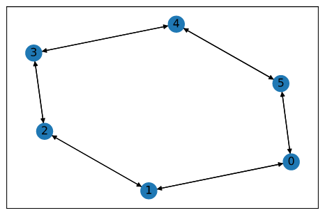
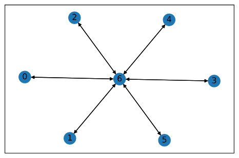
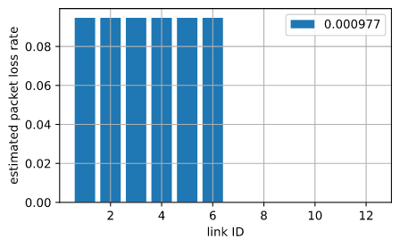
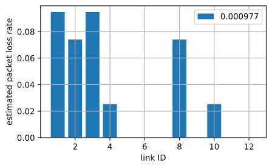
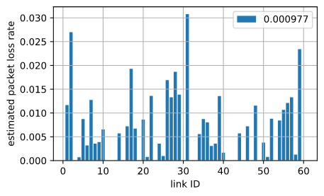
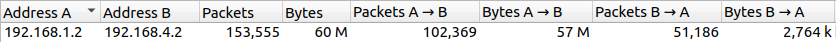
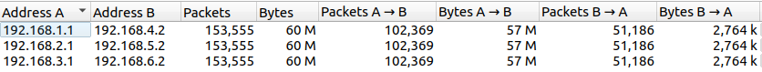

# Star Network and Ring Network Comparation

#### Note

+ This report is written in markdown. If the PDF version is too hard to read, consider reading on github: [Report On Github](https://github.com/danganhvu1998/myINIAD/blob/master/theoryClass/report/report.md)

## Abstract

It is very clear that in network topology, a `ring network`(RN) will have a better tolerance when link error occur over a `star network`(SN). When a link error occur, immediately, a part of SN is disconnected to the rest, while 2 link errors is needed for a part of RN to be disconnected. But of course, there is many downside of RN over SN as well. Next we will consider two network aspect over RN and SN: `packet lost rate tolerance` and `network congestion`

## Objective

We want to compare SN with RN over 2 aspects: `packet lost rate` and `network congestion`. In here, we expect SN will have a better perfomance in both in consideration aspects. Though experiment, we want to test the theory purposed above, and also gain deeper look into it.

## Experiment

### Packet Lost Rate Tolerance Experimental

+ [Expemient Code Link](https://github.com/danganhvu1998/myINIAD/blob/master/theoryClass/report/report.ipynb)
+ In both RN and SN with same amount of node and route, we will set a pre-determined route lost rate and see with that setting, how many links in network are bad link (with lost rate > 0.05). The more links in the network are bad link, the better bad link tolerance that network have, or more stable in other words.
+ Network Build
    + We build the all the network with number of node `numNode` is always even, node index start from 0 to `numNode`-1.
    + All node with index `nodeIndex`  smaller than `numNode` / 2 will send packet to `nodeIndex` + `numNode` / 2
      + The route will be choosen randomly if multiple
  + Ring Network Build 
  + Star Network Build 
+ Lost rate
  + All routes lost rate are setted to be 0.1
+ **Result**
  + With `numNode` to be 6
    + Star network 
    + Ring network 
  + With `numNode` to be 30
    + Star network 
    + Ring network 
  + We can see that in all case, number of bad links SN can tolerate is always higer compare to number of bad links a simillar RN can tolerate. And when `numNode` is relatively small, RN can tolerate few bad links only (mostly smaller than 5). In contract, SN always can tolerate at most `numNode` / 2 of bad links. Overall, we can say about packet loss rate tolarance, SN is better than RN

### Network Congestion

+ [Ring Network Expemient Code Link](https://github.com/danganhvu1998/myINIAD/blob/master/theoryClass/report/circleNetwork.cc)
+ [Star Network Expemient Code Link](https://github.com/danganhvu1998/myINIAD/blob/master/theoryClass/report/starNetwork.cc)
+ Send node and its receiver node will be defined bellow. In this experiment each send node will send 50Mb to its corenponding receive node and all links capacity are setted to 100Mbps and 5ms delay. Here we will see how much data each node have to be transfer. The more data a single node have to transfer, the worse network congetion is.
+ Network Build
  + We build the all the network with number of node `numNode` is 6, node index start from 0 to 5.
  + All node with index `nodeIndex`  smaller than 3 will send packet to `nodeIndex` + 3. 
    + The route will be choosen randomly if multiple
  + Ring Network Build 
  + Star Network Build 
+ **Result**
  + Star network
    + Every nodes transfer about 60Mb of data except a single node have to transfer about 180Mb of data. 
  + Ring network
    + Some nodes transfer about 60Mb, some are 120Mb and 1 have to transfer 180Mb
  + We can see that in this case, SN is slightly out perform RN. But we will see a far greater result if we incease `numNode`, or decrease link capacity, etc. Overall, we can say about network congestion, SN is better than RN

## Consideration

+ Overall, we can say that ST is better than RN about both `packet lost rate tolerance` and `network congestion`. But in ST, the core node is very important as if there is problems about `network congestion` or `packet lost`, the affect will be very significant. To use both strong point of two network topology, we can build it as a `Star Network` with the core is a small version of `Ring Network`.
